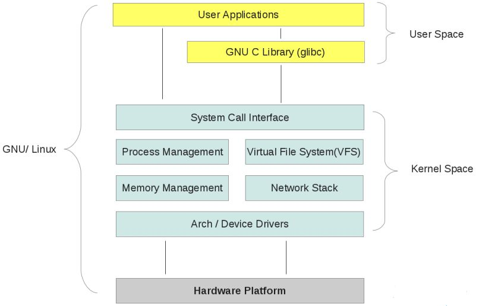
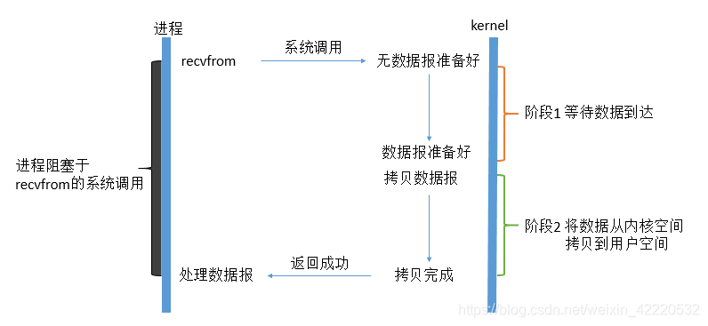
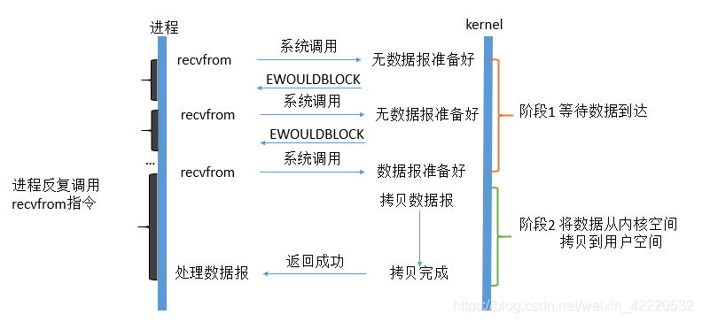
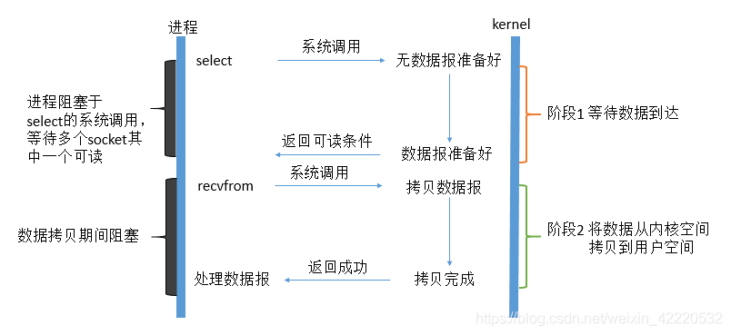
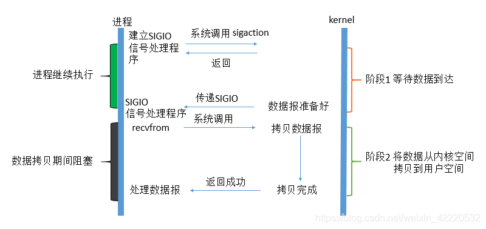
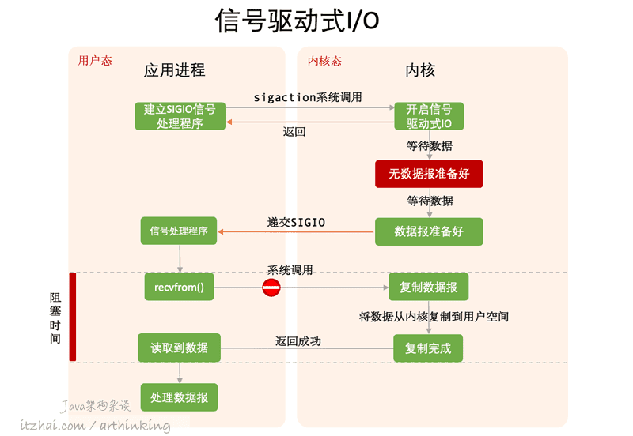
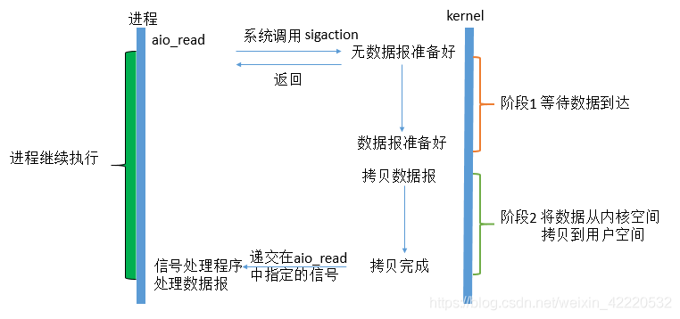

###IO模型
#### 一：什么是IO
- 在Linux中一切皆为文件，文件都是流。不管是socker、FIFO、管道
、终端，对我们来说都是文件都是流。在信息交换的过程中我们会对这些
流的数据进行操作，简称IO 。往流中读出数据系统调用read() 写数据
系统调用write().
- 计算机有那么多流他是怎么识别我们要操作哪个流的呢？文件描述符fd
，一个fd是一个整数，对fd的操作就是对流（文件）的操作。例如：我们
创建一个socket 系统会返回一个fd描述符，那么剩下的对socket的操作
就是对这个fd的操作。这也是一种分层和抽象的思想。
#### 二：IO交互
- 通常用户进程的一个IO交互经历以下阶段。
1.磁盘空间 数据通过磁盘控制器 拷贝进入到内核空间 的缓冲区
2.内核空间 缓冲区数据拷贝进入到用户空间 某个进程的缓冲区
图示：
- 无论是磁盘io还是网络IO都是通过系统内核来操作的
磁盘空间－－》内核空间
网络　　－－》内核空间
- Linux提供两级保护机制：0级提供内核使用、3级提供用户使用
- 内核会为每一个IO维护一个缓冲区，如果存在则可以直接返回给用户
如果不存需要从对应io设备中存取（例：磁盘，网卡）,简单举例等待一个
网络输入操作包括以下两个阶段：
（1）等待网络数据到达网卡-》读取到内核缓冲区（2）从内核缓冲区复
制数据-》到用户空间
##### 1 阻塞IO（blocking IO)
在等待系统返回数据之前进程会一直阻塞，直到有数据处理成功。

用户进程调用recvfrom系统调用，系统内核kernel开始调用或接收流到
某个内核缓冲区，用户进程阻塞。 系统内核将数据准备好后，将数据从内核
空间的缓冲区拷贝到用户空间，kernel返回结果，用户进程接触阻塞。
##### 2 非阻塞IO（non-blocking IO)
linux 下可以设置socket 使其变成non-blocking。流程如下：

第一阶段：用户进程调用系统调用recvfrom,kernel内核当场回复数据
报未准备好，然后用户进程反复调用recvfrom,直到kernel内核准备好
数据报后，用户进程阻塞。
第二阶段：阻塞的用户进程等待，kernel内核把数据拷贝到用户空间后，
kernel通知用户进程，用户进程解除阻塞，开始处理数据报。
##### 3 多路复用IO
select系统调用 epoll poll 系统调用

IO多路复用的本质类似非阻塞IO，不过使用了内核本身select方法，由内核
来进行本来由用户进程进行的轮询操作，看似比非阻塞IO还多了一个系统调用
的开销，但实际上因为支持多路IO，可以提高效率。
第一阶段：用户进程调用select系统调用，kernel内核开始准备数据，用户
进程阻塞。等到kernel准备好数据报后，通知用户可读条件。
第二阶段：用户进程发起recvfrom调用，kernel从内核空间拷贝数据到
用户空间，期间用户进程阻塞，直到拷贝完成后返回成功。
注意：其实在调用select的第一阶段期间用户进程是被block的，只不过
是被select系统调用block而非IO的block。它的优势在于能处理更多的
链接。
针对本模型适合处理更多的IO链接，而非单独的链接。
##### 4 信号驱动式IO
内核版本（SVR4使用SIGPOLL信号,Berkeley使用SIGIO信号）

第一阶段：用户进程调用sigaction系统调用，kernel内核返回成功，基于
此成功建立SIGIO信号处理程序。用户进程继续执行非阻塞，系统内核等待数
据处理报准备好后，传递信号SIGIO给用户进程的信号处理程序。
第二阶段：用户进程调用recvfrom系统调用，内核将数据拷贝到用户空
间，期间用户进程阻塞，拷贝完成后返回成功，阻塞接触。
图二：

##### 5 异步IO
这类函数的工作机制就是 用户进程告诉系统做什么，让内核在完全操作
完成后通知用户进程。

第一阶段：用户发起aio_read系统调用kernel立即返回结果给用户进程
用户进程不阻塞，kernel等待数据到达内核缓存区。
第二阶段：内核将数据从内核空间拷贝到用户空间，拷贝完成后主动递交
在aio_read中指定的信号给用户进程的信号处理程序。用户进程开始
处理数据报。
##### 总结：

其实前四种I/O模型都是同步I/O操作，他们的区别在于第一阶段，而他
们的第二阶段是一样的：在数据从内核复制到应用缓冲区期间（用户空间
），进程阻塞于recvfrom调用。
